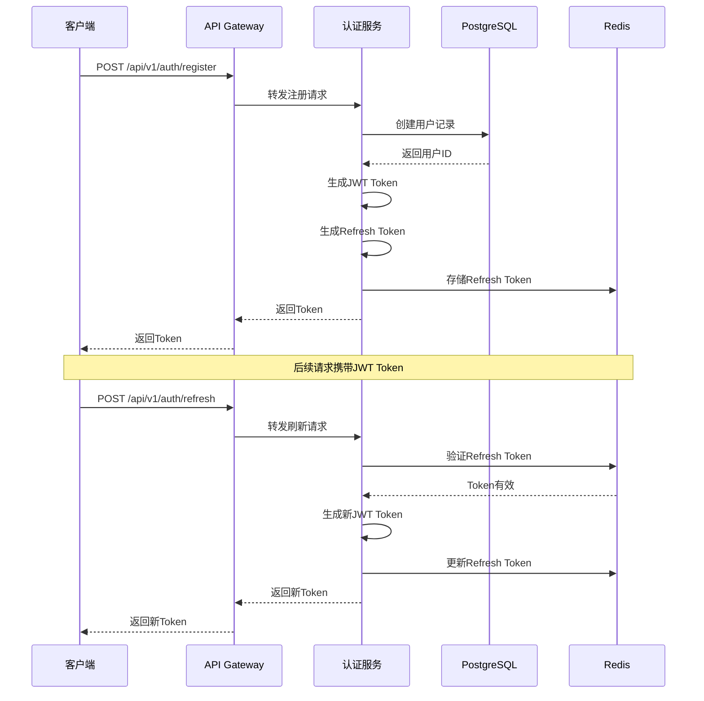
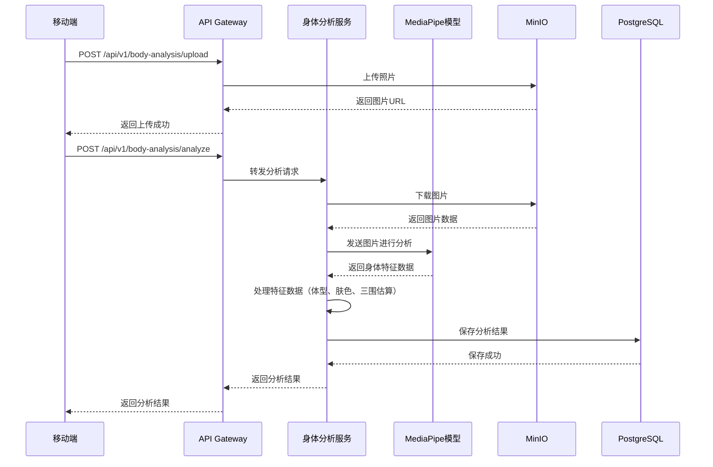
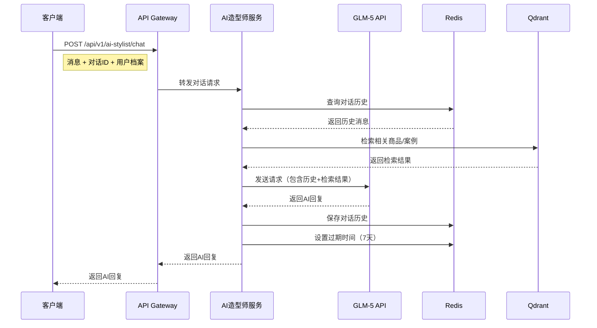
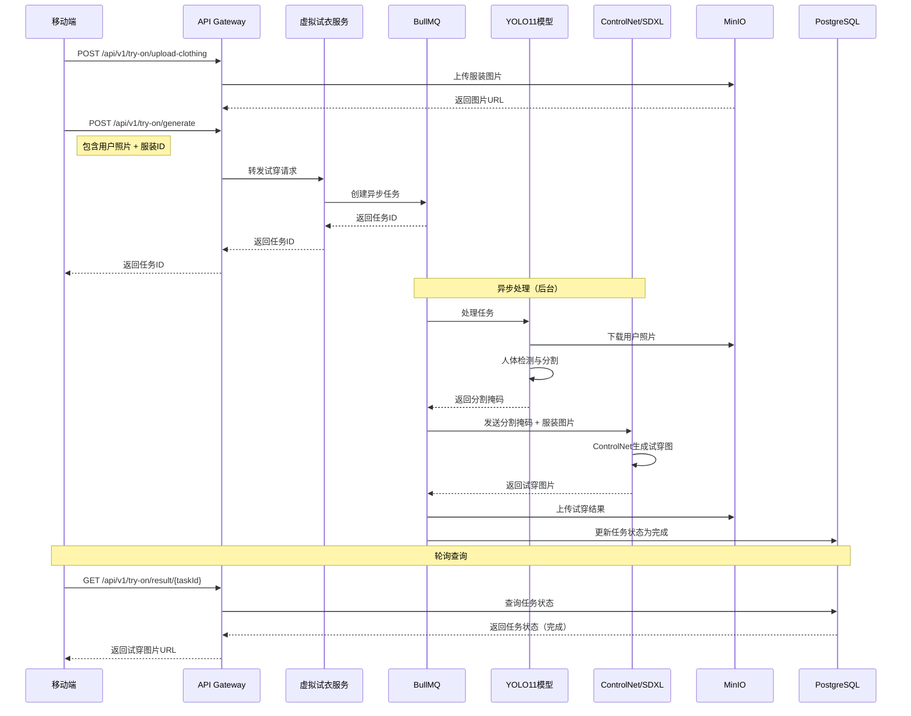

# 阶段1：架构设计
## 1.3 系统架构设计与数据库设计

---

### 1.3.1 系统架构总览

```mermaid
graph TB
    subgraph "客户端层 - Clients"
        WebApp[Web应用<br/>Next.js 15.x]
        AndroidApp[Android应用<br/>React Native 0.74.x]
        HarmonyApp[鸿蒙应用<br/>ArkUI-X<br/>（暂停开发）]
    end

    subgraph "网关层 - Gateway"
        APIGateway[NestJS API Gateway<br/>端口: 3001]
        RateLimiter[限流中间件]
        AuthMiddleware[JWT认证中间件]
    end

    subgraph "业务服务层 - Services"
        AuthService[认证服务<br/>Auth Module]
        BodyAnalysisService[身体分析服务<br/>Body Analysis Module]
        AIStylistService[AI造型师服务<br/>AI Stylist Module]
        RecommendationService[推荐服务<br/>Recommendation Module]
        VirtualTryOnService[虚拟试衣服务<br/>Virtual Try-On Module]
        ProductService[商品服务<br/>Product Module]
        WardrobeService[衣橱服务<br/>Wardrobe Module]
        CommunityService[社区服务<br/>Community Module]
        OrderService[订单服务<br/>Order Module]
        AnalyticsService[数据统计服务<br/>Analytics Module]
    end

    subgraph "AI服务层 - AI Services"
        LLMAPI[GLM-5 / GPT-4 API<br/>对话生成]
        BodyAnalysisModel[MediaPipe PoseLandmarker<br/>身体检测]
        FashionCLIPModel[FashionCLIP<br/>服装特征提取]
        YOLO11Model[YOLO11<br/>人体检测与分割]
        VirtualTryOnModel[ControlNet / SDXL<br/>虚拟试衣]
        VectorEmbedding[Text/Image Embedding<br/>向量嵌入]
    end

    subgraph "数据层 - Data Layer"
        PostgreSQL[(PostgreSQL 16.x<br/>关系型数据库)]
        Redis[(Redis 7.x<br/>缓存 + 会话)]
        Qdrant[(Qdrant<br/>向量数据库)]
        MinIO[(MinIO<br/>对象存储)]
    end

    subgraph "消息队列层 - Message Queue"
        BullMQ[BullMQ<br/>异步任务处理]
    end

    subgraph "监控与日志层 - Monitoring"
        Sentry[Sentry<br/>错误追踪]
        Prometheus[Prometheus<br/>性能监控]
        ELK[ELK Stack<br/>日志管理]
        Grafana[Grafana<br/>可视化看板]
    end

    %% 连接关系
    WebApp --> APIGateway
    AndroidApp --> APIGateway
    HarmonyApp -.暂停开发.-> APIGateway

    APIGateway --> RateLimiter
    RateLimiter --> AuthMiddleware

    AuthMiddleware --> AuthService
    AuthMiddleware --> BodyAnalysisService
    AuthMiddleware --> AIStylistService
    AuthMiddleware --> RecommendationService
    AuthMiddleware --> VirtualTryOnService
    AuthMiddleware --> ProductService
    AuthMiddleware --> WardrobeService
    AuthMiddleware --> CommunityService
    AuthMiddleware --> OrderService
    AuthMiddleware --> AnalyticsService

    %% 服务与AI模型的连接
    BodyAnalysisService --> BodyAnalysisModel
    AIStylistService --> LLMAPI
    AIStylistService --> VectorEmbedding
    RecommendationService --> FashionCLIPModel
    RecommendationService --> Qdrant
    VirtualTryOnService --> YOLO11Model
    VirtualTryOnService --> VirtualTryOnModel

    %% 服务与数据库的连接
    AuthService --> PostgreSQL
    AuthService --> Redis
    BodyAnalysisService --> PostgreSQL
    BodyAnalysisService --> MinIO
    AIStylistService --> PostgreSQL
    AIStylistService --> Redis
    RecommendationService --> PostgreSQL
    RecommendationService --> Redis
    RecommendationService --> Qdrant
    VirtualTryOnService --> PostgreSQL
    VirtualTryOnService --> MinIO
    ProductService --> PostgreSQL
    ProductService --> MinIO
    ProductService --> Redis
    WardrobeService --> PostgreSQL
    WardrobeService --> MinIO
    CommunityService --> PostgreSQL
    CommunityService --> MinIO
    OrderService --> PostgreSQL
    OrderService --> Redis
    AnalyticsService --> PostgreSQL
    AnalyticsService --> Redis

    %% 异步任务
    VirtualTryOnService --> BullMQ
    BodyAnalysisService --> BullMQ
    RecommendationService --> BullMQ

    %% 监控连接
    APIGateway -.错误追踪.-> Sentry
    AuthService -.性能监控.-> Prometheus
    BodyAnalysisService -.日志管理.-> ELK
    AIStylistService -.可视化.-> Grafana

    %% 样式
    classDef primary fill:#4CAF50,color:#fff
    classDef secondary fill:#2196F3,color:#fff
    classDef tertiary fill:#FF9800,color:#fff
    classDef quartic fill:#9C27B0,color:#fff
    classDef quintic fill:#F44336,color:#fff

    class WebApp,AndroidApp,HarmonyApp primary
    class APIGateway,RateLimiter,AuthMiddleware secondary
    class AuthService,BodyAnalysisService,AIStylistService,RecommendationService,VirtualTryOnService,ProductService,WardrobeService,CommunityService,OrderService,AnalyticsService tertiary
    class LLMAPI,BodyAnalysisModel,FashionCLIPModel,YOLO11Model,VirtualTryOnModel,VectorEmbedding quartic
    class PostgreSQL,Redis,Qdrant,MinIO,BullMQ,Sentry,Prometheus,ELK,Grafana quintic
```



---

### 1.3.2 核心数据流设计

#### 1. 用户注册登录流程



#### 2. 身体分析流程



#### 3. AI造型师对话流程



#### 4. 虚拟试衣流程



---

### 1.3.3 数据库设计

#### 1. 用户相关表

```sql
-- 用户表
CREATE TABLE users (
    id UUID PRIMARY KEY DEFAULT gen_random_uuid(),
    email VARCHAR(255) UNIQUE NOT NULL,
    phone VARCHAR(20) UNIQUE,
    password_hash VARCHAR(255) NOT NULL,
    nickname VARCHAR(100),
    avatar_url VARCHAR(500),
    gender VARCHAR(10), -- 'male', 'female', 'other'
    birth_date DATE,
    created_at TIMESTAMP DEFAULT CURRENT_TIMESTAMP,
    updated_at TIMESTAMP DEFAULT CURRENT_TIMESTAMP,
    is_active BOOLEAN DEFAULT TRUE
);

CREATE INDEX idx_users_email ON users(email);
CREATE INDEX idx_users_phone ON users(phone);

-- 用户设备表
CREATE TABLE user_devices (
    id UUID PRIMARY KEY DEFAULT gen_random_uuid(),
    user_id UUID NOT NULL REFERENCES users(id) ON DELETE CASCADE,
    device_type VARCHAR(20) NOT NULL, -- 'android', 'ios', 'web', 'harmony'
    device_token VARCHAR(500),
    last_active_at TIMESTAMP,
    created_at TIMESTAMP DEFAULT CURRENT_TIMESTAMP
);

CREATE INDEX idx_user_devices_user_id ON user_devices(user_id);

-- 用户偏好表
CREATE TABLE user_preferences (
    id UUID PRIMARY KEY DEFAULT gen_random_uuid(),
    user_id UUID NOT NULL REFERENCES users(id) ON DELETE CASCADE,
    style_tags JSONB, -- 风格标签: ['minimalist', 'korean', 'french']
    color_preferences JSONB, -- 颜色偏好: ['#FF5733', '#33FF57']
    size_preferences JSONB, -- 尺码偏好: {tops: 'M', bottoms: 'L'}
    budget_range JSONB, -- 预算范围: {min: 100, max: 1000}
    updated_at TIMESTAMP DEFAULT CURRENT_TIMESTAMP,
    UNIQUE(user_id)
);

-- 刷新令牌表
CREATE TABLE refresh_tokens (
    id UUID PRIMARY KEY DEFAULT gen_random_uuid(),
    user_id UUID NOT NULL REFERENCES users(id) ON DELETE CASCADE,
    token VARCHAR(500) UNIQUE NOT NULL,
    expires_at TIMESTAMP NOT NULL,
    created_at TIMESTAMP DEFAULT CURRENT_TIMESTAMP
);

CREATE INDEX idx_refresh_tokens_user_id ON refresh_tokens(user_id);
CREATE INDEX idx_refresh_tokens_expires_at ON refresh_tokens(expires_at);
```

#### 2. 身体档案相关表

```sql
-- 身体分析记录表
CREATE TABLE body_analyses (
    id UUID PRIMARY KEY DEFAULT gen_random_uuid(),
    user_id UUID NOT NULL REFERENCES users(id) ON DELETE CASCADE,
    photo_url VARCHAR(500) NOT NULL,
    photo_hash VARCHAR(64), -- 图片哈希，用于去重
    body_type VARCHAR(20), -- 'H', 'A', 'Y', 'X', 'O'
    skin_tone VARCHAR(20), -- 'light', 'medium', 'dark', etc.
    color_season VARCHAR(20), -- 'spring', 'summer', 'autumn', 'winter'
    height_estimate FLOAT, -- 估算身高（厘米）
    shoulder_width FLOAT, -- 肩宽（厘米）
    chest_circumference FLOAT, -- 胸围（厘米）
    waist_circumference FLOAT, -- 腰围（厘米）
    hip_circumference FLOAT, -- 臀围（厘米）
    confidence_score FLOAT, -- 置信度分数
    analysis_metadata JSONB, -- 额外元数据
    created_at TIMESTAMP DEFAULT CURRENT_TIMESTAMP
);

CREATE INDEX idx_body_analyses_user_id ON body_analyses(user_id);
CREATE INDEX idx_body_analyses_photo_hash ON body_analyses(photo_hash);
CREATE INDEX idx_body_analyses_created_at ON body_analyses(created_at DESC);
```

#### 3. 商品相关表

```sql
-- 商品表
CREATE TABLE products (
    id UUID PRIMARY KEY DEFAULT gen_random_uuid(),
    name VARCHAR(255) NOT NULL,
    description TEXT,
    price DECIMAL(10, 2) NOT NULL,
    original_price DECIMAL(10, 2),
    category_id UUID NOT NULL REFERENCES product_categories(id),
    brand VARCHAR(100),
    images JSONB NOT NULL, -- ['url1', 'url2', 'url3']
    specifications JSONB, -- 规格参数
    stock_quantity INTEGER DEFAULT 0,
    sales_count INTEGER DEFAULT 0,
    view_count INTEGER DEFAULT 0,
    average_rating DECIMAL(3, 2),
    rating_count INTEGER DEFAULT 0,
    tags JSONB, -- ['casual', 'summer', 'minimalist']
    style_tags JSONB, -- 风格标签
    color_tags JSONB, -- 颜色标签
    material VARCHAR(100),
    size_options JSONB, -- ['XS', 'S', 'M', 'L', 'XL']
    is_active BOOLEAN DEFAULT TRUE,
    is_featured BOOLEAN DEFAULT FALSE,
    vector_id VARCHAR(100), -- 向量数据库ID
    created_at TIMESTAMP DEFAULT CURRENT_TIMESTAMP,
    updated_at TIMESTAMP DEFAULT CURRENT_TIMESTAMP
);

CREATE INDEX idx_products_category_id ON products(category_id);
CREATE INDEX idx_products_is_active ON products(is_active);
CREATE INDEX idx_products_is_featured ON products(is_featured);
CREATE INDEX idx_products_created_at ON products(created_at DESC);
CREATE INDEX idx_products_sales_count ON products(sales_count DESC);

-- 商品分类表
CREATE TABLE product_categories (
    id UUID PRIMARY KEY DEFAULT gen_random_uuid(),
    name VARCHAR(100) NOT NULL,
    slug VARCHAR(100) UNIQUE NOT NULL,
    parent_id UUID REFERENCES product_categories(id),
    description TEXT,
    icon_url VARCHAR(500),
    sort_order INTEGER DEFAULT 0,
    is_active BOOLEAN DEFAULT TRUE,
    created_at TIMESTAMP DEFAULT CURRENT_TIMESTAMP
);

CREATE INDEX idx_product_categories_parent_id ON product_categories(parent_id);
CREATE INDEX idx_product_categories_slug ON product_categories(slug);

-- 商品收藏表
CREATE TABLE user_favorites (
    id UUID PRIMARY KEY DEFAULT gen_random_uuid(),
    user_id UUID NOT NULL REFERENCES users(id) ON DELETE CASCADE,
    product_id UUID NOT NULL REFERENCES products(id) ON DELETE CASCADE,
    created_at TIMESTAMP DEFAULT CURRENT_TIMESTAMP,
    UNIQUE(user_id, product_id)
);

CREATE INDEX idx_user_favorites_user_id ON user_favorites(user_id);
CREATE INDEX idx_user_favorites_product_id ON user_favorites(product_id);

-- 商品浏览历史表
CREATE TABLE product_view_history (
    id UUID PRIMARY KEY DEFAULT gen_random_uuid(),
    user_id UUID NOT NULL REFERENCES users(id) ON DELETE CASCADE,
    product_id UUID NOT NULL REFERENCES products(id) ON DELETE CASCADE,
    viewed_at TIMESTAMP DEFAULT CURRENT_TIMESTAMP
);

CREATE INDEX idx_product_view_history_user_id ON product_view_history(user_id);
CREATE INDEX idx_product_view_history_product_id ON product_view_history(product_id);
CREATE INDEX idx_product_view_history_viewed_at ON product_view_history(viewed_at DESC);
```

#### 4. AI造型师相关表

```sql
-- 对话表
CREATE TABLE conversations (
    id UUID PRIMARY KEY DEFAULT gen_random_uuid(),
    user_id UUID NOT NULL REFERENCES users(id) ON DELETE CASCADE,
    title VARCHAR(255), -- 对话标题（自动生成）
    model VARCHAR(50) DEFAULT 'glm-5', -- 使用的模型
    created_at TIMESTAMP DEFAULT CURRENT_TIMESTAMP,
    updated_at TIMESTAMP DEFAULT CURRENT_TIMESTAMP
);

CREATE INDEX idx_conversations_user_id ON conversations(user_id);
CREATE INDEX idx_conversations_created_at ON conversations(created_at DESC);

-- 消息表
CREATE TABLE messages (
    id UUID PRIMARY KEY DEFAULT gen_random_uuid(),
    conversation_id UUID NOT NULL REFERENCES conversations(id) ON DELETE CASCADE,
    role VARCHAR(20) NOT NULL, -- 'user', 'assistant'
    content TEXT NOT NULL,
    metadata JSONB, -- 额外元数据（如检索结果）
    created_at TIMESTAMP DEFAULT CURRENT_TIMESTAMP
);

CREATE INDEX idx_messages_conversation_id ON messages(conversation_id);
CREATE INDEX idx_messages_created_at ON messages(created_at);

-- AI推荐历史表
CREATE TABLE ai_recommendations (
    id UUID PRIMARY KEY DEFAULT gen_random_uuid(),
    user_id UUID NOT NULL REFERENCES users(id) ON DELETE CASCADE,
    conversation_id UUID REFERENCES conversations(id) ON DELETE SET NULL,
    product_ids UUID[] NOT NULL, -- 推荐的商品ID数组
    reasoning TEXT, -- 推荐理由
    feedback VARCHAR(20), -- 用户反馈: 'like', 'dislike', 'neutral'
    created_at TIMESTAMP DEFAULT CURRENT_TIMESTAMP
);

CREATE INDEX idx_ai_recommendations_user_id ON ai_recommendations(user_id);
```

#### 5. 虚拟试衣相关表

```sql
-- 虚拟试衣任务表
CREATE TABLE virtual_try_on_tasks (
    id UUID PRIMARY KEY DEFAULT gen_random_uuid(),
    user_id UUID NOT NULL REFERENCES users(id) ON DELETE CASCADE,
    user_photo_url VARCHAR(500) NOT NULL,
    clothing_id UUID REFERENCES products(id) ON DELETE SET NULL,
    clothing_image_url VARCHAR(500) NOT NULL,
    result_image_url VARCHAR(500),
    status VARCHAR(20) DEFAULT 'pending', -- 'pending', 'processing', 'completed', 'failed'
    error_message TEXT,
    processing_time_ms INTEGER, -- 处理耗时
    model_used VARCHAR(50), -- 使用的模型
    created_at TIMESTAMP DEFAULT CURRENT_TIMESTAMP,
    completed_at TIMESTAMP
);

CREATE INDEX idx_virtual_try_on_tasks_user_id ON virtual_try_on_tasks(user_id);
CREATE INDEX idx_virtual_try_on_tasks_status ON virtual_try_on_tasks(status);
CREATE INDEX idx_virtual_try_on_tasks_created_at ON virtual_try_on_tasks(created_at DESC);

-- 用户上传的服装表
CREATE TABLE user_clothing_uploads (
    id UUID PRIMARY KEY DEFAULT gen_random_uuid(),
    user_id UUID NOT NULL REFERENCES users(id) ON DELETE CASCADE,
    image_url VARCHAR(500) NOT NULL,
    category VARCHAR(50), -- 'top', 'bottom', 'dress', etc.
    style_tags JSONB,
    color_tags JSONB,
    is_processed BOOLEAN DEFAULT FALSE, -- 是否已提取特征
    vector_id VARCHAR(100), -- 向量数据库ID
    created_at TIMESTAMP DEFAULT CURRENT_TIMESTAMP
);

CREATE INDEX idx_user_clothing_uploads_user_id ON user_clothing_uploads(user_id);
```

#### 6. 衣橱相关表

```sql
-- 衣橱物品表
CREATE TABLE wardrobe_items (
    id UUID PRIMARY KEY DEFAULT gen_random_uuid(),
    user_id UUID NOT NULL REFERENCES users(id) ON DELETE CASCADE,
    name VARCHAR(255) NOT NULL,
    image_url VARCHAR(500) NOT NULL,
    category VARCHAR(50) NOT NULL, -- 'top', 'bottom', 'outerwear', 'shoes', 'accessories'
    style_tags JSONB, -- ['casual', 'formal', etc.]
    color_tags JSONB, -- ['black', 'white', etc.]
    season_tags JSONB, -- ['spring', 'summer', 'autumn', 'winter']
    occasion_tags JSONB, -- ['casual', 'business', etc.]
    brand VARCHAR(100),
    purchase_date DATE,
    last_worn_date DATE,
    wear_count INTEGER DEFAULT 0,
    notes TEXT,
    created_at TIMESTAMP DEFAULT CURRENT_TIMESTAMP,
    updated_at TIMESTAMP DEFAULT CURRENT_TIMESTAMP
);

CREATE INDEX idx_wardrobe_items_user_id ON wardrobe_items(user_id);
CREATE INDEX idx_wardrobe_items_category ON wardrobe_items(category);

-- 搭配建议表
CREATE TABLE outfit_suggestions (
    id UUID PRIMARY KEY DEFAULT gen_random_uuid(),
    user_id UUID NOT NULL REFERENCES users(id) ON DELETE CASCADE,
    item_ids UUID[] NOT NULL, -- 包含的物品ID
    occasion VARCHAR(50), -- 场合: 'casual', 'business', 'date', etc.
    weather VARCHAR(50), -- 天气: 'sunny', 'rainy', etc.
    reasoning TEXT, -- 搭配理由
    is_suggested_by_ai BOOLEAN DEFAULT FALSE,
    created_at TIMESTAMP DEFAULT CURRENT_TIMESTAMP
);

CREATE INDEX idx_outfit_suggestions_user_id ON outfit_suggestions(user_id);
```

#### 7. 社区相关表

```sql
-- 社区笔记表
CREATE TABLE community_posts (
    id UUID PRIMARY KEY DEFAULT gen_random_uuid(),
    user_id UUID NOT NULL REFERENCES users(id) ON DELETE CASCADE,
    title VARCHAR(255) NOT NULL,
    content TEXT,
    images JSONB, -- ['url1', 'url2', 'url3']
    product_tags UUID[], -- 关联的商品ID
    style_tags JSONB,
    color_tags JSONB,
    location VARCHAR(100),
    likes_count INTEGER DEFAULT 0,
    comments_count INTEGER DEFAULT 0,
    shares_count INTEGER DEFAULT 0,
    views_count INTEGER DEFAULT 0,
    is_published BOOLEAN DEFAULT FALSE,
    created_at TIMESTAMP DEFAULT CURRENT_TIMESTAMP,
    updated_at TIMESTAMP DEFAULT CURRENT_TIMESTAMP
);

CREATE INDEX idx_community_posts_user_id ON community_posts(user_id);
CREATE INDEX idx_community_posts_is_published ON community_posts(is_published);
CREATE INDEX idx_community_posts_created_at ON community_posts(created_at DESC);

-- 用户关注表
CREATE TABLE user_follows (
    id UUID PRIMARY KEY DEFAULT gen_random_uuid(),
    follower_id UUID NOT NULL REFERENCES users(id) ON DELETE CASCADE,
    following_id UUID NOT NULL REFERENCES users(id) ON DELETE CASCADE,
    created_at TIMESTAMP DEFAULT CURRENT_TIMESTAMP,
    UNIQUE(follower_id, following_id),
    CHECK(follower_id != following_id)
);

CREATE INDEX idx_user_follows_follower_id ON user_follows(follower_id);
CREATE INDEX idx_user_follows_following_id ON user_follows(following_id);

-- 点赞表
CREATE TABLE post_likes (
    id UUID PRIMARY KEY DEFAULT gen_random_uuid(),
    user_id UUID NOT NULL REFERENCES users(id) ON DELETE CASCADE,
    post_id UUID NOT NULL REFERENCES community_posts(id) ON DELETE CASCADE,
    created_at TIMESTAMP DEFAULT CURRENT_TIMESTAMP,
    UNIQUE(user_id, post_id)
);

CREATE INDEX idx_post_likes_user_id ON post_likes(user_id);
CREATE INDEX idx_post_likes_post_id ON post_likes(post_id);

-- 评论表
CREATE TABLE post_comments (
    id UUID PRIMARY KEY DEFAULT gen_random_uuid(),
    post_id UUID NOT NULL REFERENCES community_posts(id) ON DELETE CASCADE,
    user_id UUID NOT NULL REFERENCES users(id) ON DELETE CASCADE,
    parent_id UUID REFERENCES post_comments(id) ON DELETE CASCADE, -- 回复评论
    content TEXT NOT NULL,
    likes_count INTEGER DEFAULT 0,
    created_at TIMESTAMP DEFAULT CURRENT_TIMESTAMP,
    updated_at TIMESTAMP DEFAULT CURRENT_TIMESTAMP
);

CREATE INDEX idx_post_comments_post_id ON post_comments(post_id);
CREATE INDEX idx_post_comments_user_id ON post_comments(user_id);
CREATE INDEX idx_post_comments_parent_id ON post_comments(parent_id);
```

#### 8. 订单相关表

```sql
-- 购物车表
CREATE TABLE cart_items (
    id UUID PRIMARY KEY DEFAULT gen_random_uuid(),
    user_id UUID NOT NULL REFERENCES users(id) ON DELETE CASCADE,
    product_id UUID NOT NULL REFERENCES products(id) ON DELETE CASCADE,
    quantity INTEGER NOT NULL DEFAULT 1,
    size VARCHAR(20),
    color VARCHAR(50),
    created_at TIMESTAMP DEFAULT CURRENT_TIMESTAMP,
    updated_at TIMESTAMP DEFAULT CURRENT_TIMESTAMP,
    UNIQUE(user_id, product_id, size, color)
);

CREATE INDEX idx_cart_items_user_id ON cart_items(user_id);
CREATE INDEX idx_cart_items_product_id ON cart_items(product_id);

-- 订单表
CREATE TABLE orders (
    id UUID PRIMARY KEY DEFAULT gen_random_uuid(),
    user_id UUID NOT NULL REFERENCES users(id) ON DELETE CASCADE,
    order_number VARCHAR(50) UNIQUE NOT NULL,
    status VARCHAR(20) DEFAULT 'pending', -- 'pending', 'paid', 'shipped', 'delivered', 'cancelled'
    total_amount DECIMAL(10, 2) NOT NULL,
    payment_method VARCHAR(50),
    payment_status VARCHAR(20) DEFAULT 'unpaid', -- 'unpaid', 'paid', 'refunded'
    shipping_address JSONB,
    contact_phone VARCHAR(20),
    contact_name VARCHAR(100),
    notes TEXT,
    created_at TIMESTAMP DEFAULT CURRENT_TIMESTAMP,
    updated_at TIMESTAMP DEFAULT CURRENT_TIMESTAMP
);

CREATE INDEX idx_orders_user_id ON orders(user_id);
CREATE INDEX idx_orders_order_number ON orders(order_number);
CREATE INDEX idx_orders_status ON orders(status);
CREATE INDEX idx_orders_created_at ON orders(created_at DESC);

-- 订单项表
CREATE TABLE order_items (
    id UUID PRIMARY KEY DEFAULT gen_random_uuid(),
    order_id UUID NOT NULL REFERENCES orders(id) ON DELETE CASCADE,
    product_id UUID NOT NULL REFERENCES products(id) ON DELETE CASCADE,
    product_name VARCHAR(255) NOT NULL,
    product_image_url VARCHAR(500),
    price DECIMAL(10, 2) NOT NULL,
    quantity INTEGER NOT NULL,
    size VARCHAR(20),
    color VARCHAR(50)
);

CREATE INDEX idx_order_items_order_id ON order_items(order_id);
```

#### 9. 数据统计相关表

```sql
-- 用户行为事件表
CREATE TABLE analytics_events (
    id UUID PRIMARY KEY DEFAULT gen_random_uuid(),
    user_id UUID REFERENCES users(id) ON DELETE SET NULL,
    event_type VARCHAR(50) NOT NULL, -- 'page_view', 'product_click', 'search', etc.
    event_data JSONB, -- 事件详细数据
    page_url VARCHAR(500),
    device_type VARCHAR(20),
    created_at TIMESTAMP DEFAULT CURRENT_TIMESTAMP
);

CREATE INDEX idx_analytics_events_user_id ON analytics_events(user_id);
CREATE INDEX idx_analytics_events_event_type ON analytics_events(event_type);
CREATE INDEX idx_analytics_events_created_at ON analytics_events(created_at);

-- 每日统计表
CREATE TABLE daily_statistics (
    id UUID PRIMARY KEY DEFAULT gen_random_uuid(),
    date DATE NOT NULL UNIQUE,
    active_users INTEGER DEFAULT 0,
    new_users INTEGER DEFAULT 0,
    total_orders INTEGER DEFAULT 0,
    total_revenue DECIMAL(10, 2) DEFAULT 0,
    ai_calls_count INTEGER DEFAULT 0,
    try_on_count INTEGER DEFAULT 0,
    created_at TIMESTAMP DEFAULT CURRENT_TIMESTAMP
);

CREATE INDEX idx_daily_statistics_date ON daily_statistics(date);
```

---

### 1.3.4 Redis数据结构设计

```redis
# 用户Session
session:{userId} -> {
    "userId": "uuid",
    "deviceInfo": {...},
    "lastActivity": timestamp
}

# Token黑名单
token:blacklist:{token} -> "1" (TTL: 7天)

# 缓存
products:list:page:{page} -> JSON (TTL: 5分钟)
products:detail:{id} -> JSON (TTL: 10分钟)
recommendations:user:{userId} -> JSON (TTL: 30分钟)

# 对话历史
conversation:{conversationId}:messages -> List (TTL: 7天)

# AI调用频率限制
ratelimit:ai:{userId}:{minute} -> count (TTL: 1分钟)

# 虚拟试衣任务状态
tryon:task:{taskId} -> JSON (TTL: 24小时)

# 热门数据
trending:products -> Sorted Set (TTL: 1小时)
trending:hashtags -> Sorted Set (TTL: 1小时)
```

---

### 1.3.5 向量数据库设计

```json
{
  "collection_name": "products",
  "vector_size": 512,
  "distance_metric": "Cosine",
  "payload": {
    "product_id": "uuid",
    "name": "string",
    "category_id": "uuid",
    "style_tags": ["string"],
    "color_tags": ["string"],
    "price": number,
    "is_active": boolean
  }
}
```

---

### 1.3.6 API接口规范

#### 统一响应格式

```typescript
// 成功响应
{
  "success": true,
  "data": any,
  "message": string | null,
  "timestamp": number
}

// 错误响应
{
  "success": false,
  "error": {
    "code": string,
    "message": string,
    "details": any
  },
  "timestamp": number
}
```

#### 认证方式

```http
# JWT Token (Header)
Authorization: Bearer {access_token}

# Refresh Token (Header)
X-Refresh-Token: {refresh_token}
```

#### 分页参数

```http
# 请求
GET /api/v1/products?page=1&limit=20&sort=created_at&order=desc

# 响应
{
  "success": true,
  "data": {
    "items": [...],
    "pagination": {
      "page": 1,
      "limit": 20,
      "total": 100,
      "totalPages": 5
    }
  }
}
```

---

**文档版本：** v1.0
**创建时间：** 2026-03-20
**创建人：** AI研发负责人
